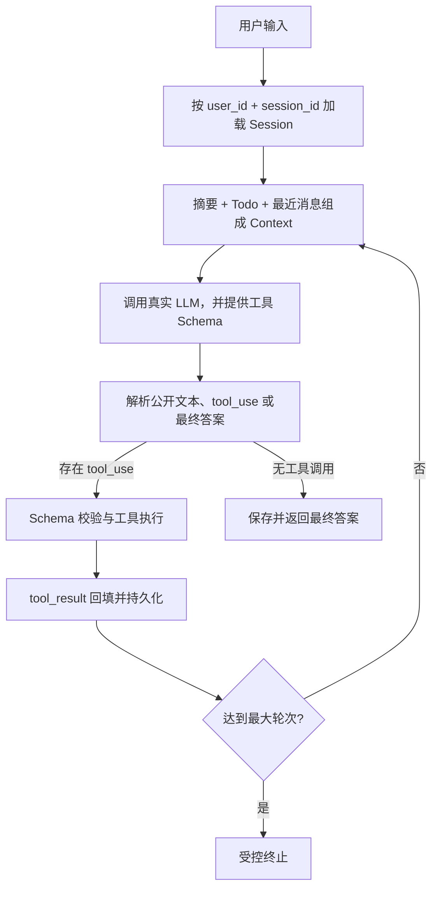

# Minimal Agent Runtime

这是一个不依赖 LangGraph、OpenHands、OpenClaw 等 Agent 框架的最小可用 Agent。核心循环、工具注册、输出解析、Session、Context 压缩和 Trace 均在本项目中自行实现；OpenAI SDK 只负责调用阿里云百炼的 OpenAI 兼容 API。

代码仓库：[github.com/AluzzzZ/agent_demo](https://github.com/AluzzzZ/agent_demo)

## 完成度

| 题目要求 | 实现位置 | 状态 |
|---|---|---|
| LLM → 工具 → LLM 基本循环 | `runtime.py` | 完成 |
| LLM 按 Schema 自主调用工具 | `tools/registry.py` | 完成 |
| 输出解析 | `parser.py` | 完成 |
| calculator / search / weather / todo | `tools/builtin.py` | 完成（后三者中 search、weather 为 mock） |
| 多用户、多窗口 Session | `storage.py` 的 SQLite 复合键 | 完成 |
| 普通追问与工具追问 | 完整 Session 消息召回 | 完成 |
| Context 基础压缩 | `context.py` | 完成 |
| 最大轮次 | `AgentRuntime.max_iterations` | 完成，默认 8 |
| 异常处理与结构化 Trace | Registry、SDK 重试、JSONL | 完成 |
| 稳定单测与真实 API smoke | `tests/` | 完成 |

## 快速运行

需要 Python 3.11 或更高版本。

```powershell
python -m venv .venv
.\.venv\Scripts\Activate.ps1
python -m pip install -e ".[dev]"
$env:DASHSCOPE_API_KEY="轮换后的 API Key"
$env:DASHSCOPE_BASE_URL="https://dashscope.aliyuncs.com/api/v1"
$env:DASHSCOPE_MODEL="deepseek-v4-pro"
minimal-agent --user user-a --session window-1
```

`/api/v1` 是 DashScope 原生地址。`DashScopeLLM` 会将它转换成 Function Calling 所需的 `/compatible-mode/v1`；也可以直接把兼容地址传给 `--base-url`。模型与工具调用支持情况见[阿里云 DeepSeek API 文档](https://help.aliyun.com/zh/model-studio/deepseek-api)和[Function Calling 文档](https://help.aliyun.com/zh/model-studio/qwen-function-calling)。

单次运行：

```powershell
minimal-agent --user user-a --session window-1 --once "查上海明天天气，并记一个带伞的待办"
```

默认数据写入 `data/agent.db`，Trace 写入 `data/traces.jsonl`。API Key 只从环境变量读取，不会写入数据库或日志。

## 多窗口 Session 演示

打开两个终端，共用同一个数据库但使用不同 `session_id`：

```powershell
# 终端 1
minimal-agent --user user-a --session window-1

# 终端 2
minimal-agent --user user-a --session window-2
```

窗口 1 的天气、对话和待办不会进入窗口 2。退出后再次用相同的 `--user/--session` 启动，会从 SQLite 恢复历史。完整录屏步骤见 [docs/DEMO_SCRIPT.md](docs/DEMO_SCRIPT.md)。

## 系统设计



主流程只有一个通用循环。增加工具不需要改 `AgentRuntime`，只需向 `ToolRegistry` 注册：

```python
ToolDefinition(
    name="my_tool",
    description="告诉模型何时使用",
    input_schema={"type": "object", "properties": {...}},
    handler=my_handler,
)
```

Registry 负责重名检查、JSON Schema 合法性、调用参数校验、统一错误包装和结构化 Trace。Handler 通过 `ToolContext` 获得当前 `user_id/session_id`，因此待办不会串窗口。

## Context 与 Memory

每次模型调用放入：

- 固定 System Prompt 与全部工具 Schema；
- 当前 Session 的旧历史摘要；
- 当前 Session 的 Todo 快照；
- 尚未被摘要覆盖的最近完整消息；
- 当前用户输入，以及成对的 `tool_use/tool_result`。

不放入：其他 Session、完整 Trace、已被摘要覆盖的原始旧消息、模型隐藏思维链。

召回发生在每次 LLM 调用之前。短期消息以 Provider-neutral block 放入 `messages`，DashScope Adapter 再转换为 OpenAI 的 `assistant.tool_calls` 和 `tool` 消息；长期摘要和 Todo 以明确标签放入 `system` 的当前会话记忆区。原始历史始终保留在 SQLite，仅发送给模型的 Context 会被压缩。

当未压缩内容超过 `context_max_characters` 时，保留最近若干完整消息，将更早的完整轮次交给真实 LLM 摘要。切分点不会拆开 `tool_use` 与 `tool_result`。摘要失败时使用有界的本地截断作为降级，避免主请求完全不可用。字符阈值只是易解释的 Token 近似；生产环境可以替换成供应商的 token counting API。

关于“思考过程”：解析器只把模型主动输出的公开文本记为 `decision_summary`。隐藏 `thinking`/chain-of-thought 不提取、不落库、不写 Trace。本项目未开启 extended thinking。

## 异常与 Trace

- OpenAI SDK 对网络错误、429 和部分 5xx 进行重试；DashScope 适配器配置最多 2 次重试和 60 秒超时。
- 未知工具、非法 Schema 参数和 Handler 异常会成为带 `is_error` 的 `tool_result`，交还模型自行修正或解释。
- 每次请求最多执行 8 轮，避免无限工具循环。
- CLI 捕获最终异常并显示类型；Trace 记录失败位置。

每次用户请求生成唯一 `trace_id`。JSONL 事件包括 `request_started`、`llm_started/finished/failed`、`tool_started/finished`、`context_compacted` 和 `request_finished`。示例：

```json
{"trace_id":"...","user_id":"user-a","session_id":"window-1","event":"tool_finished","iteration":1,"tool":"weather","duration_ms":0.21,"status":"success"}
```

日志记录公开决策摘要与工具参数，不记录 API Key 或隐藏思维链。若工具参数可能包含业务敏感信息，生产版本应再增加字段脱敏。

## 测试

稳定测试使用可脚本化 Fake LLM，不花费 API 额度：

```powershell
$env:PYTHONPATH="src"
python -m pytest -m "not live_api"
```

覆盖：直接回答、Calculator、并行多工具、普通追问、天气工具追问、窗口隔离、进程重启恢复、未知工具、参数错误、最大轮次、Context 压缩和完整 Trace。

真实 DashScope `deepseek-v4-pro` smoke test 默认跳过，需要显式开启，可能产生费用：

```powershell
$env:DASHSCOPE_API_KEY="轮换后的 API Key"
$env:DASHSCOPE_BASE_URL="https://dashscope.aliyuncs.com/api/v1"
$env:DASHSCOPE_MODEL="deepseek-v4-pro"
$env:RUN_LIVE_API_TEST="1"
$env:PYTHONPATH="src"
python -m pytest -m live_api -s
```

## 项目结构

```text
src/minimal_agent/
├── runtime.py              # 主循环与最大轮次
├── parser.py               # Provider-neutral 输出解析
├── context.py              # 召回、组装与压缩
├── storage.py              # SQLite Session / messages / todos
├── tracing.py              # JSONL Trace
├── llm/dashscope_client.py # 默认：百炼/OpenAI Function Calling 适配
├── llm/anthropic_client.py # 可选 Anthropic Provider
└── tools/                  # Registry 与四个工具
tests/                      # Fake LLM 单测 + opt-in 真实 smoke
docs/                       # 问题解决记录与录屏脚本
```

## 参考仓库与复用边界

项目参考了 [shareAI-lab/learn-claude-code](https://github.com/shareAI-lab/learn-claude-code) 的单循环、`tool_use/tool_result` 和分层 Context 压缩思路。没有直接裁剪其 `s20_comprehensive`，而是针对本题重新组织 Runtime，并新增了它的教学代码未完整覆盖的多窗口 SQLite Session、统一 `ToolRegistry`、最大轮次、结构化 Trace、Provider Adapter 和题目导向测试。

参考仓库是 MIT License；归属与许可文本见 [THIRD_PARTY_NOTICES.md](THIRD_PARTY_NOTICES.md)。AI Prompt、问题与取舍记录见 [docs/AI_PROMPTS_AND_NOTES.md](docs/AI_PROMPTS_AND_NOTES.md)。

最终交付前仍需由提交者完成真实 Key smoke、录屏与远程仓库推送，见 [docs/SUBMISSION_CHECKLIST.md](docs/SUBMISSION_CHECKLIST.md)。
