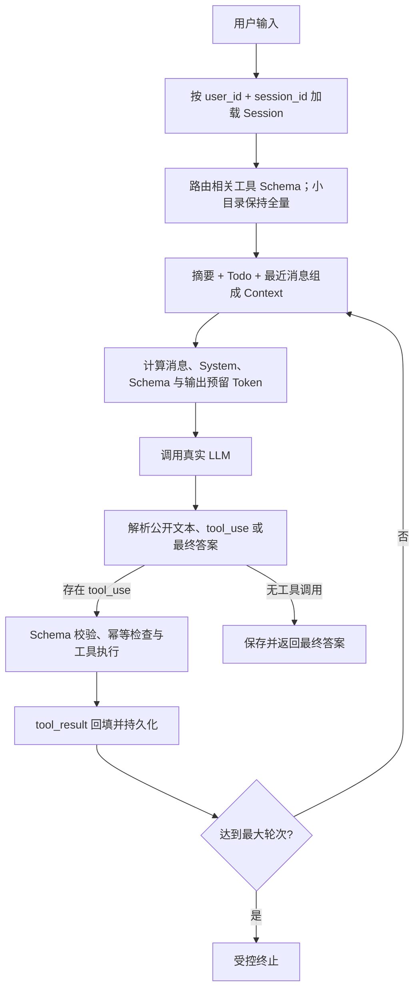

# Minimal Agent Runtime

这是一个不依赖 LangGraph、OpenHands、OpenClaw 等 Agent 框架的最小可用 Agent。核心循环、工具注册、Session管理、Context 压缩和 Trace 均在本项目中自行实现；同时提供可直接使用的本地 Web 工作台。

代码仓库：[github.com/AluzzzZ/agent_demo](https://github.com/AluzzzZ/agent_demo)

| 要求 | 实现位置 |
|---|---|
| LLM → 工具 → LLM 基本循环 | `runtime.py` |
| LLM 按 Schema 自主调用工具 | `tools/registry.py` |
| 输出解析 | `parser.py` |
| calculator / search / weather / todo | `tools/` |
| 多用户、多窗口 Session | `storage.py` 的 SQLite 复合键 |
| 普通追问与工具追问 | 完整 Session 消息召回 |
| Context 分层压缩与 Token 预算 | `context.py`、`token_budget.py` |
| 最大轮次、工具和 Token 预算 | `AgentRuntime` |
| 异常处理与结构化 Trace | Registry、SDK 重试、JSONL |
| Codex 风格 Web 工作台 | `web.py`、`web_static/` |
| 双用户登录/切换与数据隔离 | `storage.py`、`web.py` |
| 白色主题、Markdown、长消息滚动 | `web_static/` |
| 任务删除与关联数据清理 | `storage.py`、`tracing.py`、`web.py` |
| 项目 `.env` 自动加载 | `env.py` |
| 稳定单测与真实 API smoke | `tests/` |

## 快速运行

需要 Python 3.11 或更高版本。

```powershell
python -m venv .venv
.\.venv\Scripts\Activate.ps1
python -m pip install -e ".[dev,anthropic]"
Copy-Item .env.example .env
# 编辑 .env，填入 DASHSCOPE_API_KEY
minimal-agent --user user-a --session window-1
```

## Web 工作台

启动本地 Web 工作台：

```powershell
python -m minimal_agent.web
```

CLI 和 Web 启动时会自动读取当前工作目录下的 `.env`，系统环境变量优先级高于 `.env`。无效配置行会被忽略，密钥值不会写入日志；`.env` 已加入 `.gitignore`。

浏览器打开 [http://127.0.0.1:8765](http://127.0.0.1:8765)。Web 工作台包括：

- 白色响应式界面，消息区域独立滚动，输入框固定在底部；
- 助手回答安全渲染 Markdown 标题、列表、代码块、链接和表格；
- 左上角 Trace 抽屉展示模型、工具、耗时和失败阶段；
- 左下角登录、添加和切换两个本地账户；
- 左侧创建、恢复和删除任务；删除前二次确认，并同步清理消息、待办和 Trace。

默认本地账户：

- `zsw1 / 123456`
- `zsw2 / 123456`

可在 `.env.example` 所列的 `DEMO_USER_1_* / DEMO_USER_2_*` 环境变量中替换用户名、密码和显示名称。密码使用 PBKDF2 摘要保存在 SQLite，浏览器保存可撤销的随机 Bearer Token；这是本地演示认证，不应用作公网生产身份系统。

所有 Session、消息、删除和 Trace 请求都以服务端从 Token 解析出的 `user_id` 过滤，前端不能自行提交其他用户 ID。不同用户以及同一用户的不同会话互不读取；同一会话的并发请求在当前 Web 进程内串行执行。

Search 默认调用 Wikipedia/MediaWiki Action API，Weather 调用 Open-Meteo Geocoding + Forecast API，两者都无需 API Key。Wikipedia 搜索只覆盖 Wikipedia，不是通用互联网搜索；Open-Meteo 免费入口适用于非商业用途并要求署名，商业部署前需重新确认其条款或切换合规 Provider。

`/api/v1` 是 DashScope 原生地址。`DashScopeLLM` 会将它转换成 Function Calling 所需的 `/compatible-mode/v1`；也可以直接把兼容地址传给 `--base-url`。模型与工具调用支持情况见[阿里云 DeepSeek API 文档](https://help.aliyun.com/zh/model-studio/deepseek-api)和[Function Calling 文档](https://help.aliyun.com/zh/model-studio/qwen-function-calling)。

单次运行：

```powershell
minimal-agent --user user-a --session window-1 --once "查上海明天天气，并记一个带伞的待办"
```

默认数据写入 `data/agent.db`，Trace 写入 `data/traces.jsonl`。API Key 只从进程环境或项目 `.env` 读取，不会写入数据库或 Trace；Trace 写入前会对常见 Secret 字段和值做基础脱敏。

运行预算可通过 `.env` 调整：`AGENT_MAX_ITERATIONS`、`AGENT_MAX_TOOL_CALLS`、`AGENT_MAX_TOTAL_TOKENS`、`AGENT_CONTEXT_MAX_TOKENS`、`AGENT_CONTEXT_WINDOW_TOKENS` 和 `AGENT_RESERVED_OUTPUT_TOKENS`。大型工具目录使用 `AGENT_FULL_TOOL_CATALOG_THRESHOLD` 与 `AGENT_MAX_SELECTED_TOOLS` 控制何时启用路由及每轮最多注入多少个完整 Schema。

## 多窗口 Session 演示

打开两个终端，共用同一个数据库但使用不同 `session_id`：

```powershell
# 终端 1
minimal-agent --user user-a --session window-1

# 终端 2
minimal-agent --user user-a --session window-2
```

窗口 1 的天气、对话和待办不会进入窗口 2。退出后再次用相同的 `--user/--session` 启动，会从 SQLite 恢复历史。完整录屏步骤见 [docs/DEMO_SCRIPT.md](docs/DEMO_SCRIPT.md)。

## 系统设计



主流程只有一个通用循环。增加工具不需要改 `AgentRuntime`，只需向 `ToolRegistry` 注册：

```python
ToolDefinition(
    name="my_tool",
    description="告诉模型何时使用",
    input_schema={"type": "object", "properties": {...}},
    handler=my_handler,
)
```

Registry 负责重名检查、JSON Schema 合法性、调用参数校验、统一错误包装、工具目录路由和结构化 Trace。Handler 通过 `ToolContext` 获得当前 `user_id/session_id`，因此待办不会串窗口。已完成工具调用按 `(user_id, session_id, call_id)` 持久化；相同参数会直接回放结果，不同参数复用同一 ID 会被拒绝，避免重复写待办等副作用。

## Context 与 Memory

每次模型调用放入：

- 稳定的核心 System Prompt，以及当前 Session 的动态记忆；
- 小型工具目录的全部 Schema，或大型目录中路由得到的相关 Schema；
- 当前 Session 的旧历史摘要；
- 当前 Session 的 Todo 快照；
- 尚未被摘要覆盖的最近完整消息；
- 当前用户输入，以及成对的 `tool_use/tool_result`。

不放入：其他 Session、完整 Trace、已被摘要覆盖的原始旧消息、模型隐藏思维链。

召回发生在每次 LLM 调用之前。短期消息以 Provider-neutral block 放入 `messages`，DashScope Adapter 再转换为 OpenAI 的 `assistant.tool_calls` 和 `tool` 消息；长期摘要和 Todo 以明确标签放入 `system` 的当前会话记忆区。原始历史始终保留在 SQLite，仅发送给模型的 Context 视图会被裁剪或压缩。

预算同时计算 System Prompt、消息、Todo/摘要、工具 Schema，并预留模型输出空间。达到软上限时先裁剪较早的大型工具结果，再默认保留最近约 4 个完整用户轮次并摘要更早历史。一个完整轮次包括用户输入、模型工具调用、全部工具结果和最终回答，不会在工具链中间切断。摘要失败时使用有界本地降级，连续三次失败后打开熔断。若供应商仍报告上下文过长，Runtime 会强制压缩并只重试一次。保留轮数可通过 `AGENT_KEEP_RECENT_TURNS` 调整。

默认工具较少时全量提供 Schema；注册工具超过阈值后，Runtime 根据工具名称、描述和 `routing_hints` 选择 Top-K，并始终保留 `tool_search`。目录搜索得到的工具会在下一轮激活。`context_preflight` Trace 会显示消息、System、Schema、输出预留及软硬上限的 Token 估算。

关于“思考过程”：解析器只把模型主动输出的公开文本记为 `decision_summary`。隐藏 `thinking`/chain-of-thought 不提取、不落库、不写 Trace。本项目未开启 extended thinking。

## 异常与 Trace

- OpenAI SDK 对网络错误、429 和部分 5xx 进行重试；DashScope 适配器配置最多 2 次重试和 60 秒超时。
- 未知工具、未激活工具、非法 Schema 参数和 Handler 异常会成为带 `is_error` 的 `tool_result`，交还模型自行修正或解释。
- 模型超时、限流、连接、5xx、上下文过长和无效响应映射为稳定错误码；用户只看到安全文案，底层类型和脱敏信息留在 Trace。
- 每次请求默认最多执行 8 轮、24 次工具调用，并可配置累计模型 Token 上限。
- 相同工具调用 ID 的完成结果持久化回放，避免模型重发或恢复流程造成重复副作用。

每次用户请求生成唯一 `trace_id`。JSONL 事件包括 `request_started`、`tool_schema_selected`、`context_preflight`、`llm_started/finished/failed`、`tool_started/finished/replayed`、`context_compacted`、`request_failed` 和 `request_finished`。示例：

```json
{"trace_id":"...","user_id":"user-a","session_id":"window-1","event":"tool_finished","iteration":1,"tool":"weather","duration_ms":0.21,"status":"success"}
```

日志记录公开决策摘要与脱敏后的工具参数，不记录 API Key 或隐藏思维链。生产版本仍应按业务字段扩展 PII 脱敏策略。

## 测试

稳定测试使用可脚本化 Fake LLM，不花费 API 额度：

```powershell
$env:PYTHONPATH="src"
python -m pytest -m "not live_api"
```

覆盖：直接回答、Calculator、并行多工具、普通追问、天气工具追问、窗口隔离、进程重启恢复、未知工具、参数错误、工具幂等回放、动态 Schema 路由、模型失败归一化、响应式压缩重试、最大轮次、Context 压缩、完整 Trace、免费 Provider 契约、`.env` 加载、双用户登录、越权隔离和任务删除。

真实 DashScope `deepseek-v4-pro` smoke test 默认跳过，需要显式开启，可能产生费用：

```powershell
$env:DASHSCOPE_API_KEY="轮换后的 API Key"
$env:DASHSCOPE_BASE_URL="https://dashscope.aliyuncs.com/api/v1"
$env:DASHSCOPE_MODEL="deepseek-v4-pro"
$env:RUN_LIVE_API_TEST="1"
$env:PYTHONPATH="src"
python -m pytest -m live_api -s
```

## 项目结构

```text
src/minimal_agent/
├── runtime.py              # 主循环与最大轮次
├── parser.py               # Provider-neutral 输出解析
├── context.py              # 召回、组装与压缩
├── token_budget.py         # System、消息、工具 Schema 与输出预留预算
├── env.py                  # 安全加载项目根目录 .env
├── errors.py               # 稳定模型/工具错误码与安全文案
├── http_client.py          # 免费 API 共用超时、重试和限长
├── storage.py              # SQLite Session / messages / todos
├── tracing.py              # JSONL Trace
├── web.py                  # FastAPI、双用户登录与 Session/Trace API
├── web_static/             # Codex 风格原生 HTML/CSS/JavaScript
├── llm/dashscope_client.py # 默认：百炼/OpenAI Function Calling 适配
├── llm/anthropic_client.py # 可选 Anthropic Provider
└── tools/                  # Registry、四个业务工具与 tool_search
tests/                      # Fake LLM 单测 + opt-in 真实 smoke
```
