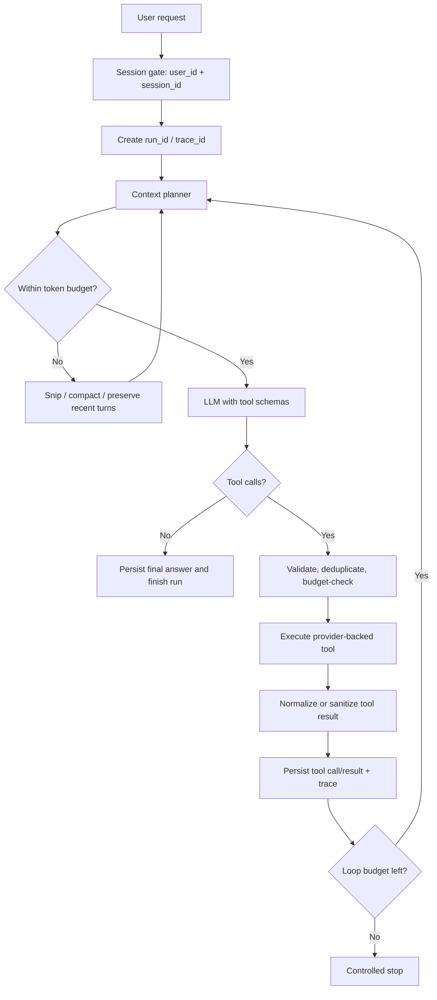

# Minimal Agent 基于 claw-code-agent 的升级与复用计划

## 1. 结论

建议保留当前 `minimal_agent` 的核心骨架，按能力点增量升级；不建议用 `claw-code-agent` 整体替换，也不建议直接复制其源码。

主要原因：

1. 当前项目已经完整覆盖题目要求的最小 Loop、工具注册、Provider-neutral 消息、SQLite Session、Context 摘要和 JSONL Trace，代码规模小，边界清晰。
2. 当前项目的 `(user_id, session_id)` 复合键比参考项目仅凭 `session_id` 保存 JSON 更适合多用户、多窗口场景。
3. 参考项目值得借鉴的是 token 预算、分层压缩、prompt 超长预检/恢复、工具调用去重、工具结果脱敏和真实搜索 Provider 设计。
4. 参考项目的主 Runtime 超过 4,000 行，混合了 coding agent、插件、委派、权限、GUI、预算、工作树等大量本题不需要的能力，整体移植会显著增加复杂度和回归面。
5. 在审阅的固定版本 `167571da895b2a1a9e36ecfae2876984cef65e0d` 中，仓库根目录没有 LICENSE 文件；README 的 “open-source” 徽章不能替代明确的软件许可证。获得明确授权前，应只借鉴公开的架构思想并自行实现，不能直接复制代码。

建议路线：**保留 70%～80% 现有代码，新增 Provider、Budget、Compaction、Run/Trace 四层，重构约 20%～30% 的运行时边界。**

### 本轮落地状态（2026-08-11）

本轮已经完成可直接运行的最小升级，后续高级能力仍按下文 Phase 2～5 演进：

| 交付项 | 状态 | 实现 |
|---|---|---|
| 免费 Search | 已完成 | Wikipedia/MediaWiki，无 Key，含超时、重试、限长与标准结果 |
| 免费 Weather | 已完成 | Open-Meteo Geocoding + Forecast，无 Key，含地点错误与署名 |
| Codex 风格 Web 前端 | 已完成 | 会话侧栏、聊天、工具卡片、响应式布局 |
| 左上角 Trace | 已完成 | Trace 列表、模型/工具次数、事件时间线、失败状态 |
| 左下角双用户 | 已完成 | 两个可配置账户登录、添加、退出和快速切换 |
| 服务端用户隔离 | 已完成 | Bearer Token 解析用户，Session/消息/Trace 均做归属过滤 |
| 同 Session 并发 | MVP 已完成 | Web 单进程 keyed lock 串行；多进程 lease 留在 Phase 2 |
| 基础异常与脱敏 | 已完成 | 稳定工具错误、上游重试、安全 Web 错误、Trace 基础脱敏 |
| 基础 Context 管理 | 保留现有实现 | 最大 8 轮、旧摘要 + Todo + 最近消息、工具追问不断链 |

## 2. 审阅基线与验证结果

- 当前项目：`AluzzzZ/agent_demo`，本地提交 `401fd1e`。
- 参考项目：`HarnessLab/claw-code-agent`，审阅提交 `167571da895b2a1a9e36ecfae2876984cef65e0d`，提交时间 2026-06-22。
- 当前项目审阅前基线：`21 passed, 1 deselected`，总语句覆盖率 77%；本轮实现后为 `28 passed, 1 deselected`（以最终验证为准）。
- 参考项目定向测试：Loop、Context、Session、Search、Secret Redaction 共 136 项，在 Windows 上 `134 passed, 2 failed`；两项失败均与 Bash/Unix shell 行为有关，说明其代码不能不加适配地直接移植到 Windows。

参考源码入口：

- [参考项目主页](https://github.com/HarnessLab/claw-code-agent)
- [Agent Loop](https://github.com/HarnessLab/claw-code-agent/blob/167571da895b2a1a9e36ecfae2876984cef65e0d/src/agent_runtime.py#L528-L1155)
- [Context 压缩](https://github.com/HarnessLab/claw-code-agent/blob/167571da895b2a1a9e36ecfae2876984cef65e0d/src/compact.py#L446-L637)
- [Session Store](https://github.com/HarnessLab/claw-code-agent/blob/167571da895b2a1a9e36ecfae2876984cef65e0d/src/session_store.py)
- [Search Runtime](https://github.com/HarnessLab/claw-code-agent/blob/167571da895b2a1a9e36ecfae2876984cef65e0d/src/search_runtime.py)

## 3. 参考项目如何实现题目要求

### 3.1 Agent Loop

参考项目在 `LocalCodingAgent.run()` 中执行有界 `for turn_index in range(...)`：

1. 把用户输入追加到 Session。
2. 在每次 LLM 调用前做 microcompact、snip、compact 和 prompt-length preflight。
3. 调用模型并把公开回答、tool calls 和 usage 写入 Session。
4. 若无 tool calls，则直接返回最终结果；若响应被长度截断，则生成 continuation prompt 继续一轮。
5. 若有 tool calls，则逐个校验预算、执行工具、回填 `tool` 消息，然后回到 Loop。
6. 达到 `max_turns` 时受控终止并持久化 Session。

参考实现还增加了重复 `tool_call_id` 防重、工具流式输出、权限/插件 preflight、token/cost/tool/model-call 预算。这些不是最小 Loop 的必要条件，但其中“防重”和“预算”值得复用设计。

当前项目在 `src/minimal_agent/runtime.py` 已经实现同一个核心状态机，而且更短、更适合本题。Loop 本身不应替换。

### 3.2 工具与真实 API

参考项目的工具注册包含名称、描述、Schema 和 Handler；执行结果统一为 `ToolExecutionResult`。其 `SearchRuntime` 支持：

- SearXNG：本地或自托管，无 API Key；
- Brave Search：`BRAVE_SEARCH_API_KEY`；
- Tavily：`TAVILY_API_KEY`；
- Provider 发现、启用状态、结果归一化、超时和域名过滤。

参考项目没有天气工具。因此：

- Search 可借鉴 Provider/Profile/normalized result 的设计，但自行实现；
- Weather 需要新增 Geocoder + Forecast Provider，不能从该仓库复用。

### 3.3 Session 管理

参考项目把每个 Agent Session 保存为 `.port_sessions/agent/<session_id>.json`，保存消息、运行配置、usage、cost、工具调用计数、文件历史和插件状态，并通过 `agent-resume` 恢复。

它能做到“不同 session_id 的对话互不影响并可恢复”，但没有业务层的 `user_id` 隔离：

- Session 文件名只使用 `session_id`；
- 缺少 `(user_id, session_id)` 唯一约束和归属校验；
- 更适合单机单用户 coding agent，不适合直接作为多租户聊天后端；
- 它还会在 Session 配置中序列化 `api_key`，这一点不能复用。

当前项目的 SQLite 复合主键、外键和 Todo Session 作用域更符合要求，应保留。

### 3.4 Context 管理

参考项目提供了多层策略：

1. Tokenizer-aware 估算并计算 soft/hard prompt budget；
2. microcompact：在缓存可能失效后清理较老、可再获取的工具结果；
3. snip：把过大的旧 tool/assistant 消息替换成短预览；
4. compact：保留最近消息，把更老的 API round 压成摘要；
5. preflight：调用模型前预测是否超窗；
6. reactive compact：Provider 返回 prompt-too-long 后压缩并重试；
7. compaction circuit breaker：连续失败后停止重复压缩。

当前项目已有“旧摘要 + Todo 快照 + 最近完整消息”，并且切分时避免拆开 `tool_use/tool_result`，方向正确；不足是只按字符数估算，只压缩一次，没有计算工具 Schema、System Prompt 和 Todo 的成本，也无法处理“最近单条工具结果本身就超大”的情况。

### 3.5 异常与 Trace

参考项目会把 backend error 转成受控 `stop_reason`，记录 streaming/tool/compaction/budget 事件，并在工具结果进入历史时做常见 Secret Redaction。

当前项目的优势是独立、追加式 JSONL Trace，事件链已经包括 request、LLM、tool、compaction 和 finish；应保留这个接口并补充脱敏、错误分类、event sequence、token budget 和跨进程安全。

## 4. 当前项目差距清单

| 能力 | 当前状态 | 主要差距 | 优先级 |
|---|---|---|---|
| 基本 Loop | 已完成 | 缺 tool call 防重、总模型/工具预算 | P1 |
| Direct reply / Tool decision | 已完成 | 由模型 Function Calling 决定，设计正确 | 保留 |
| Search | Wikipedia 已接入 | 仅覆盖 Wikipedia；通用 Web 搜索需自托管 SearXNG | P2 |
| Weather | Open-Meteo 已接入 | 城市歧义候选和指定日期仍可增强 | P2 |
| 多用户多窗口 | SQLite + Web 鉴权已完成 | 多进程并发仍需数据库 lease | P1 |
| 追问 | 已完成 | 长对话摘要质量和最近大结果处理不足 | P1 |
| 最大轮次 | 每次请求默认 8 | 缺 max tool calls、max model calls、token budget | P1 |
| Context 压缩 | 字符阈值 + LLM 摘要 | 未统计完整 prompt；仅单级压缩；无超窗恢复 | P1 |
| 异常 | 工具稳定错误码 + HTTP 重试 | 模型错误仍可进一步分类 | P1 |
| Trace | JSONL 链路、sequence、基础脱敏 | 线程锁不覆盖多进程 | P1 |
| 测试 | 已增加 Provider/Web 隔离测试 | 仍需并发、超窗和完整 HTTP 故障注入 | P1 |

## 5. 目标架构



建议模块边界：

```text
src/minimal_agent/
├── runtime.py                 # 只保留状态机和预算检查
├── context.py                 # ContextPlanner + compaction 策略
├── token_budget.py            # token 估算、soft/hard limit
├── storage.py                 # Session / messages / todos / runs / executions
├── errors.py                  # 稳定错误类型和错误码
├── redaction.py               # Secret/PII 基础脱敏
├── tracing.py                 # Trace sink；SQLite 为主，JSONL 可选
├── http.py                    # 共用 HTTP timeout/retry/client
├── tools/
│   ├── registry.py
│   ├── builtin.py             # calculator / todo
│   ├── search.py              # SearchTool + provider interface
│   └── weather.py             # WeatherTool + geocode/forecast provider
└── llm/                       # 保持 Provider adapter
```

## 6. Session 与持久化设计

### 6.1 业务键

继续使用 `(user_id, session_id)` 作为 Session 唯一键。API 层的 `user_id` 必须来自可信身份，不接受客户端任意冒充。`session_id` 只标识该用户的窗口。

示例：

| user_id | session_id | 内容 |
|---|---|---|
| A | window-1 | 查天气、天气追问、窗口 1 Todo |
| A | window-2 | 写周报、周报追问、窗口 2 Todo |
| B | window-1 | 用户 B 的独立上下文 |

### 6.2 表结构升级

保留 `sessions/messages/todos`，新增：

- `runs(run_id, user_id, session_id, status, started_at, finished_at, exit_reason, iteration_count, model_call_count, tool_call_count, input_tokens, output_tokens, error_code)`；
- `tool_executions(id, run_id, iteration, call_id, tool_name, arguments_json, result_json, status, error_code, started_at, duration_ms)`，并对 `(run_id, call_id)` 建唯一索引以防重复执行；
- `trace_events(id, run_id, sequence_no, event, payload_json, created_at)`；
- `sessions.version` 或 `sessions.active_run_id`，用于同一 Session 并发保护；
- `sessions.summary_version/summary_updated_at`，支持摘要 checkpoint。

### 6.3 并发语义

- 不同 Session：允许并行；
- 同一 Session：默认串行，第二个请求返回 `session_busy` 或进入有界队列；
- 不要跨 LLM 网络调用持有 SQLite 写事务；使用 `active_run_id + version` 做短事务 claim/release；
- 进程崩溃后通过 lease expiry 清理僵尸 run；
- 单进程 CLI 可先使用 keyed lock，服务化时升级为数据库 lease；如果迁移 PostgreSQL，可用 advisory lock。

## 7. Context 应放什么、不放什么

### 7.1 每次 LLM 调用应放入

1. 稳定 System Prompt：角色、工具使用规则、错误恢复规则、数据边界；
2. 当前可用工具的 Schema；
3. 当前 Session 的结构化摘要：
   - 当前目标；
   - 已确认事实和用户偏好；
   - 最近关键工具结论及时间；
   - 未完成事项/等待用户的信息；
   - 重要实体，如上次查询城市；
4. 当前 Session 的 Todo 快照；
5. 最近若干完整 turn，按语义边界保留：
   - user message；
   - assistant 的公开文本；
   - assistant tool call；
   - 对应 tool result；
6. 当前用户输入。

### 7.2 不应放入

- 其他用户或其他 Session 的任何内容；
- 模型隐藏思维链、thinking block 或内部推理；
- 完整 Trace/执行日志；
- 已由摘要覆盖的全部旧原文；
- API Key、Authorization header、cookie、数据库连接串等 Secret；
- 可再获取且已过期的超长原始工具结果；
- 与当前任务无关的 provider 配置、调试堆栈。

### 7.3 纯对话与工具追问

- 纯对话追问依赖“最近完整 turn + 摘要中的稳定事实”；
- 工具追问依赖“最近工具调用参数 + 归一化结果 + 摘要中的关键实体”。例如“那明天呢？”需要保留上次城市“上海”，不必保留天气 API 的完整原始响应；
- Tool result 应包含 `provider/retrieved_at/query/location/data`，让模型能判断是否需要重新调用工具；
- 摘要必须标注事实来源和时间，避免把旧天气当成当前事实。

### 7.4 基础压缩策略

采用三级策略，保持实现简单：

1. **Normalize/Cap**：工具结果入库前保留完整可审计结果或对象存储引用，发给模型的版本限制结果数和单项长度；
2. **Snip**：超预算时先把较老的大型工具结果替换为短记录，如 provider、查询、时间、Top 结果和错误码；
3. **Summarize**：仍超预算时，把最早的完整 turn 合并进 Session 摘要，保留最近 4～8 条消息；切分不得拆开 tool call/result；
4. **Reactive retry**：Provider 明确返回 context-length error 时最多再压缩并重试 1 次；禁止无限重试；
5. **Fallback**：摘要模型失败时使用有界本地提取/截断，但要记录 `compaction_degraded`。

Budget 计算至少覆盖：System Prompt、Tool Schema、摘要、Todo、消息 framing、消息正文、预留输出 token。精确 tokenizer 不可用时可使用保守估算，并设置 15%～20% 安全余量。

## 8. 真实 Search 与 Weather 接入

### 8.1 Search

本项目要求使用无需付费、无需 API Key 的接口。第一阶段默认接入 Wikimedia 的 MediaWiki Action API；它支持标题和正文全文检索，适合演示、知识检索和 Agent 工具追问，但不是全互联网搜索引擎。若以后需要通用 Web 搜索，可在不改变工具 Schema 的前提下增加自托管 SearXNG Provider：

```python
class SearchProvider(Protocol):
    def search(self, query: str, *, limit: int, domains: tuple[str, ...]) -> SearchResponse: ...
```

统一结果：

```json
{
  "provider": "wikipedia",
  "query": "...",
  "retrieved_at": "ISO-8601 UTC",
  "results": [
    {"title": "...", "url": "https://...", "snippet": "...", "score": 0.8}
  ]
}
```

当前默认 Provider 固定为 `wikipedia`，工具参数支持 `language=zh|en`，默认 `zh`；未来可增加 `SEARXNG_BASE_URL` 以接入自托管免费搜索。

约束：query 1～500 字符、limit 1～5、只返回 Wikipedia 的 HTTPS URL、snippet 限长、响应体限长、单次超时 12 秒。429、502、503、504 最多重试 2 次并做有界指数退避；401/403 不重试。

### 8.2 Weather

使用 Open-Meteo 免费接口：先调用 Geocoding API 将城市转成经纬度，再调用 Forecast API。免费入口无需 API Key，适合非商业演示和原型；当前官方免费条款包含非商业用途、每日 10,000 次调用上限和署名要求。商业上线不能继续使用免费入口，需改为合规的商业服务或自托管。

统一输入建议：

```json
{"location": "上海", "date": "2026-08-12", "timezone": "Asia/Shanghai"}
```

统一输出建议：

```json
{
  "provider": "open-meteo",
  "location": {"name": "上海", "latitude": 31.23, "longitude": 121.47, "timezone": "Asia/Shanghai"},
  "date": "2026-08-12",
  "retrieved_at": "ISO-8601 UTC",
  "forecast": {"weather_code": 61, "condition": "雨", "temperature_max_c": 31, "temperature_min_c": 26, "precipitation_probability_max": 70}
}
```

`today/tomorrow` 应在工具层根据 Session/请求时区转换成 ISO 日期，不能让模型自己猜日期。地理编码多结果时优先国家/行政区匹配；仍歧义则返回候选，让 Agent 询问用户。

官方文档：

- [MediaWiki Search API](https://www.mediawiki.org/wiki/API:Search)
- [Open-Meteo Forecast API](https://open-meteo.com/en/docs)
- [Open-Meteo Geocoding API](https://open-meteo.com/en/docs/geocoding-api)
- [Open-Meteo Free API 条款](https://open-meteo.com/en/terms)

## 9. 异常处理与 Trace 规范

### 9.1 错误分类

新增稳定错误码，Handler 内部异常不得直接把堆栈或 Secret 返回模型：

- `tool_invalid_arguments`：Schema/业务参数错误，可由模型修正；
- `tool_not_configured`：缺 API Key/Provider 配置，不应原样重试；
- `tool_timeout`：可有限重试；
- `tool_rate_limited`：可在 `retry_after` 后重试或向用户解释；
- `tool_upstream_error`：5xx/非法响应；
- `model_timeout/model_rate_limited/model_context_too_long/model_invalid_response`；
- `session_busy/session_conflict`；
- `max_iterations/max_tool_calls/token_budget_exceeded`。

给模型的错误结果只包含 `error_code/message/retryable`；详细异常类型、HTTP 状态和安全截断后的响应预览只进入 Trace。

### 9.2 Trace 字段

每条事件至少包含：

- `trace_id/run_id/user_id/session_id/sequence_no/timestamp/event`；
- `iteration/model/provider/duration_ms/status`；
- `input_tokens/output_tokens/context_tokens/tool_call_count`；
- `tool/call_id/error_code/retry_count`；
- compaction 的 `before_tokens/after_tokens/messages_compacted/method`。

绝不记录：Authorization、API Key、cookie、隐藏思维链、完整敏感业务正文。工具参数先经过基于字段名和格式的脱敏。

JSONL 可以继续作为本地可读导出；权威事件建议写 SQLite `trace_events`，避免多进程追加同一文件的原子性问题。以后服务化时可把同一事件接口接到 OpenTelemetry。

## 10. 分阶段实施计划

### Phase 0：冻结基线与许可决策（0.5 天）

任务：

- 记录参考提交和“只借鉴设计、不复制源码”的 ADR；
- 冻结当前 21 个测试为回归基线；
- 为真实 API 测试建立 Key/费用开关，CI 默认只跑 mock contract。

验收：

- 有明确 ADR；
- `pytest -m "not live_api"` 继续全绿；
- 仓库和日志中不存在真实 Key。

### Phase 1：工具 HTTP 基础设施与免费 Search/Weather（2～3 天）

改动：

- 新增 `http_client.py`、`errors.py`；
- 把 `builtin.py` 中 mock search/weather 拆为 `tools/search.py`、`tools/weather.py`；
- 引入显式 `httpx` 依赖或用标准库实现等价超时；
- 保留 mock provider 作为单元测试 fixture，不作为生产默认；
- 更新 `.env.example`、README 和 live smoke test。

测试：

- 正常结果、空结果、城市歧义；
- 400/401/403/429/5xx、超时、非法 JSON、超大响应；
- 重试次数和 `retryable`；
- Key 不出现在工具结果与 Trace；
- 相同 Session 的“上海今天？→ 那明天呢？”真实/契约追问。

验收：

- Search/Weather 的生产注册不再返回 `mock: true`；
- 两个工具都不依赖 API Key，网络不可用时返回受控错误，Loop 不崩溃；
- live test 需显式环境变量开启。

### Phase 2：Run、幂等与 Session 并发（1.5～2 天）

改动：

- 迁移新增 `runs/tool_executions/trace_events`；
- 每次 `run()` 先 claim Session，finally 释放；
- `(run_id, call_id)` 唯一约束；
- 工具执行前查幂等记录，避免 Provider 超时/Runtime 重试造成重复 Todo 或重复付费调用；
- 为每轮消息增加 `run_id/turn_index` 关联。

测试：

- A/window-1、A/window-2、B/window-1 三路并行不串线；
- 同一 Session 两个并发请求被串行或明确拒绝；
- 重复 call_id 不重复创建 Todo/调用 API；
- 崩溃后 lease 可恢复。

验收：

- 多窗口独立恢复；
- 同一 Session 无消息交错；
- 所有 run 都有最终状态。

### Phase 3：Token Budget 与三级 Context 压缩（2～3 天）

改动：

- 新增 `token_budget.py`；
- Context 预算覆盖 System、Schema、摘要、Todo、消息和输出预留；
- 添加工具结果 cap、旧结果 snip、turn-aware summary；
- 摘要保存 checkpoint，原始历史仍保留；
- context-length error 仅允许压缩后重试一次；
- 添加 compaction circuit breaker。

测试：

- 纯对话长历史仍能追问稳定事实；
- 工具长结果后能继续追问；
- tool call/result 不被切断；
- 单条超大用户输入/工具结果不会无限摘要；
- 摘要 API 失败走 fallback；
- 实际组装后的 prompt 低于 hard limit。

验收：

- 每次 LLM call 的 Trace 有预算数据；
- 达到 soft limit 自动降压；
- hard limit 无法恢复时受控退出，不调用必然失败的模型请求。

### Phase 4：脱敏、Trace 与运维可观测性（1～2 天）

改动：

- 新增 `redaction.py`，覆盖常见 Key 格式和敏感字段名；
- Trace 增加 sequence、retry、token、compaction、error_code；
- SQLite 为权威 Trace，JSONL 为可选 sink；
- CLI 增加按 trace_id 查看摘要的命令或只读函数。

测试：

- 参数、错误消息、Provider 响应、工具结果中的 Secret 均被遮盖；
- 并发进程写 Trace 不丢事件；
- request_started 到 request_finished 序列完整，失败路径也完整。

验收：

- 能用一个 trace_id 还原一次请求的模型/工具/压缩顺序；
- Trace 中无明文 Key 和隐藏思维链。

### Phase 5：回归、压测与发布（1.5～2 天）

任务：

- 端到端场景测试：两个用户、每人两个窗口、普通追问、工具追问、重启恢复；
- 30～100 并发不同 Session 的 SQLite/WAL 压测；
- 上游 429/超时/断网故障注入；
- 旧数据库自动迁移和回滚演练；
- 文档、示例、演示脚本更新。

发布策略：

1. `TOOLS_MODE=mock|live`，先在测试环境开启 live；
2. `CONTEXT_BUDGET_V2` 和 `TRACE_DB_ENABLED` 使用 feature flag；
3. 先影子计算 token budget，不改变上下文；观察后再启用 snip/compact；
4. 保留旧摘要字段和 JSONL 输出一个版本，稳定后再清理兼容路径。

最终验收：

- 所有非 live 测试通过，核心模块覆盖率目标 ≥ 90%，总覆盖率目标 ≥ 85%；
- live search/weather smoke 通过；
- 两窗口状态、Todo、摘要和工具历史完全隔离；
- 超长对话不会无限 Loop 或直接崩溃；
- 任何失败都返回稳定错误并留有完整安全 Trace。

预计总工作量：**8.5～12 个工程日**。若只完成题目验收所需的最小版本（单 Search Provider、Open-Meteo、基础 token 估算、Session 锁和脱敏 Trace），可压缩到 **5～7 个工程日**。

## 11. 复用决策矩阵

| 组件 | 决策 | 理由 |
|---|---|---|
| 当前 `AgentRuntime` Loop | 保留并小改 | 已满足四步 Loop，结构清晰 |
| 当前 Provider-neutral block/parser | 保留 | 支持 OpenAI/DashScope/Anthropic 适配且不保存隐藏 thinking |
| 当前 SQLite Session/Todo | 保留并迁移 | 多用户多窗口语义优于参考项目 |
| 当前 ToolRegistry/JSON Schema | 保留 | 新工具可插拔，错误能回填模型 |
| 当前 JSONL Trace API | 保留接口、替换/增加 sink | 事件模型好，但需脱敏和跨进程安全 |
| 参考 token budget/preflight 思路 | 自行实现 | 对长 Context 很有价值 |
| 参考 microcompact/snip/compact 分层 | 简化后自行实现 | 可解决单次摘要不足，不能直接复制 |
| 参考 Search Provider 思路 | 自行实现 | 支持真实 API；需更严格错误/安全策略 |
| 参考 JSON Session Store | 不采用 | 无 `(user_id, session_id)` 租户隔离，且会序列化 API Key |
| 参考 `~/.claude/session-memory/session.md` | 不采用 | 全局路径不适合多 Session，可能串记忆 |
| 参考完整 `agent_runtime.py` | 不采用 | 体量和职责远超本题，Windows 兼容也需额外处理 |
| 参考插件/GUI/MCP/子 Agent | 暂不采用 | 不属于本次需求，避免 scope creep |

## 12. 建议的开工顺序

严格按以下顺序实施：

1. 先加真实 Search/Weather 和统一错误，不动 Loop；
2. 再加 run/tool_execution 幂等和 Session 并发门；
3. 再做 token budget 的“只观测”版本；
4. 数据稳定后启用 snip/summary/reactive retry；
5. 最后把 Trace 权威存储迁到 SQLite 并补齐压测、迁移、发布开关。

这样每个阶段都可独立验证和回滚，也不会把参考项目的复杂度一次性引入当前最小 Runtime。

## 13. 本轮直接实现范围：Web 工作台

在上述 Runtime 之上新增一个本地 Web 工作台，采用 Python Web API + 原生 HTML/CSS/JavaScript，避免引入独立前端构建链。界面参考 Codex 的信息结构，但不复制其品牌资产：

- 左侧会话栏：新建会话、列出当前用户的窗口、恢复历史；
- 左上角 Trace 入口：按当前 Session 展示 request、LLM、tool 和 compaction 事件；
- 中间聊天区：消息历史、工具调用卡片、错误状态和输入框；
- 左下角账户切换器：两个通过环境变量自定义的本地演示用户可以分别登录，并在浏览器内快速切换；
- 后端身份以不透明 Bearer Token 解析，所有 Session/消息/Trace 查询都以服务端解析出的 `user_id` 过滤，不信任前端提交的用户 ID。

两个用户通过以下环境变量初始化：

- `DEMO_USER_1_USERNAME / DEMO_USER_1_PASSWORD / DEMO_USER_1_DISPLAY_NAME`；
- `DEMO_USER_2_USERNAME / DEMO_USER_2_PASSWORD / DEMO_USER_2_DISPLAY_NAME`。

密码仅以 PBKDF2 派生摘要保存在 SQLite；浏览器保存的是可撤销的随机登录 Token。该认证用于本地演示，不等同于互联网生产环境的 OAuth/OIDC。

新增接口：

- `POST /api/auth/login`、`POST /api/auth/logout`、`GET /api/auth/me`；
- `GET/POST /api/sessions`、`GET /api/sessions/{session_id}/messages`；
- `POST /api/sessions/{session_id}/chat`；
- `GET /api/sessions/{session_id}/traces`、`GET /api/traces/{trace_id}`。

本轮验收标准：

1. 两个用户都能登录，左下角可切换，且看不到对方的 Session、消息和 Trace；
2. 每个用户可建立多个独立窗口并恢复聊天；
3. Search 使用 Wikipedia/MediaWiki 免费 API，Weather 使用 Open-Meteo 免费接口；
4. 左上角 Trace 面板能展示一次请求的 Loop 与工具事件链；
5. 既有 CLI 和测试保持兼容，Web API 测试覆盖认证、越权、会话隔离与 Trace 查询。
